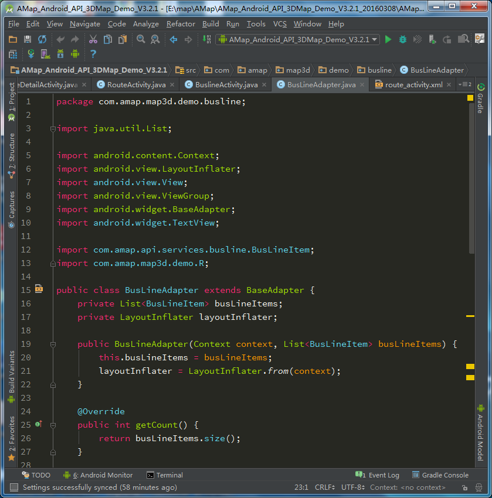
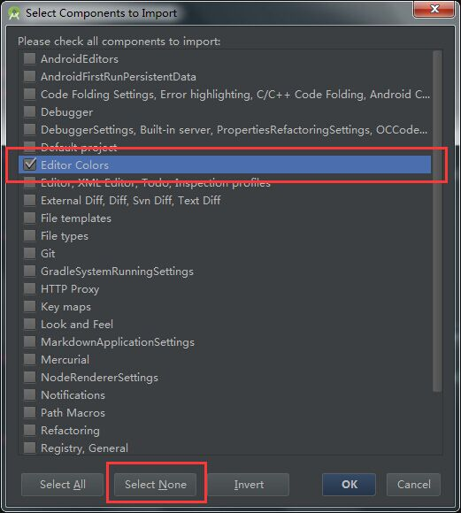

# android-studio-settings

My Settings & Monokai theme for Android Studio.

## Installation

### Just wanna Monokai theme?

1. Download the [settings.jar][] or clone this repository.
2. In Android Studio choose File > Import Settings > Choose [settings.jar][].
3. Select None > Check `Editor Colors`.

    

4. Click `OK`.

### Wanna all my settings? (Include Monokai theme)

1. Download the [settings.jar][] or clone this repository.
2. In Android Studio choose File > Import Settings > Choose [settings.jar][].
3. Click `OK`.

## Credits

* [benmarten/MonokaiAndroidStudio][]

[settings.jar]: ./settings.jar
[benmarten/MonokaiAndroidStudio]: https://github.com/benmarten/MonokaiAndroidStudio
